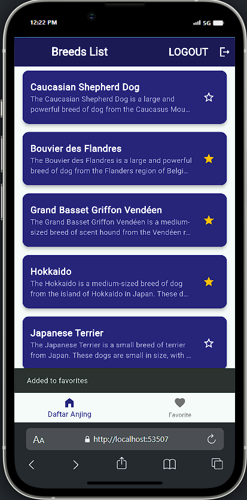

# Responsi | 123210009 | Muhammad Abdanul Ikhlas

## Deskripsi

Membuat aplikasi yang memberikan informasi mengenai anjing.

Syarat aplikasi adalah : 
- Adanya login dan register dengan penyimpanan lokal (DATABASE)
- Menyimpan anjing yang terfavorit secara lokal (SHARED PREFERENCES)
- membaca api yang tersedia
- Membuat tampilan yang bagus
- BASE URL =  https://dogapi.dog/api/v2
- DOKUMENTASI API : https://dogapi.dog/docs/api-v2

  <h1>Tampilan</h1>

  &nbsp;
  &nbsp;
  &nbsp;

 

  &nbsp;
  &nbsp;
  &nbsp;

